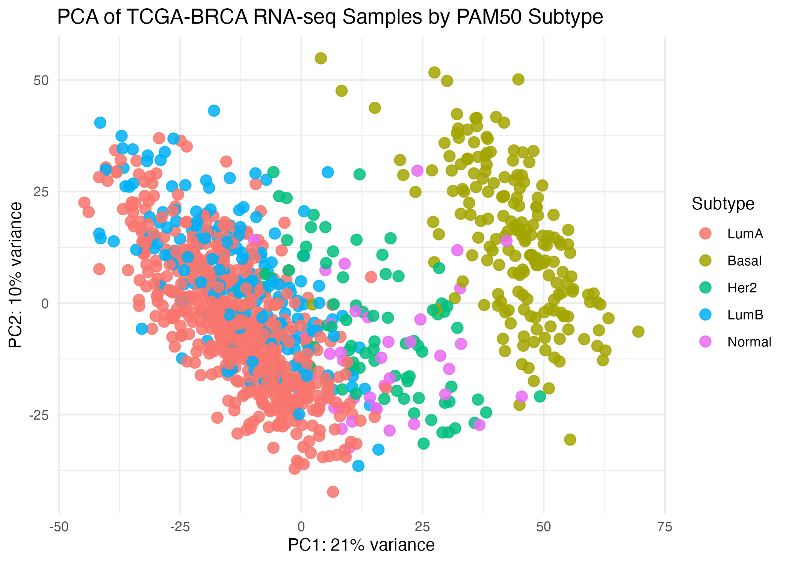
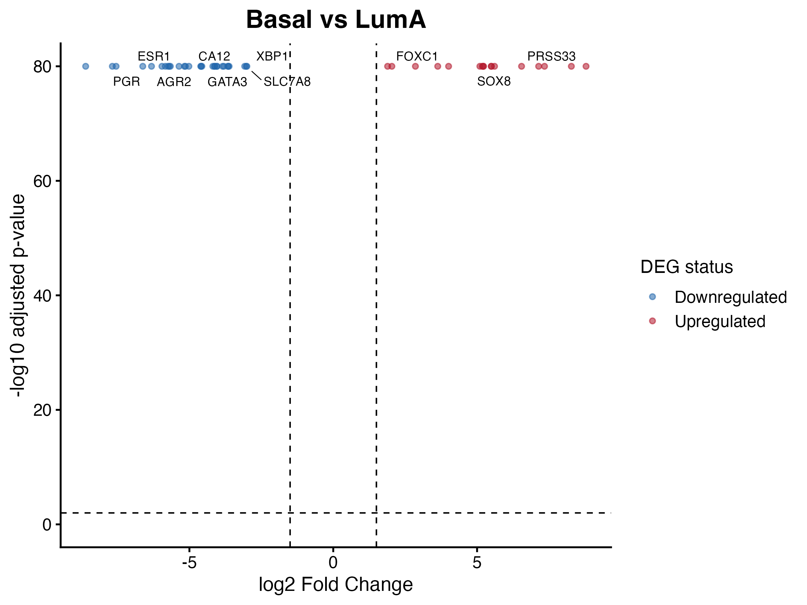
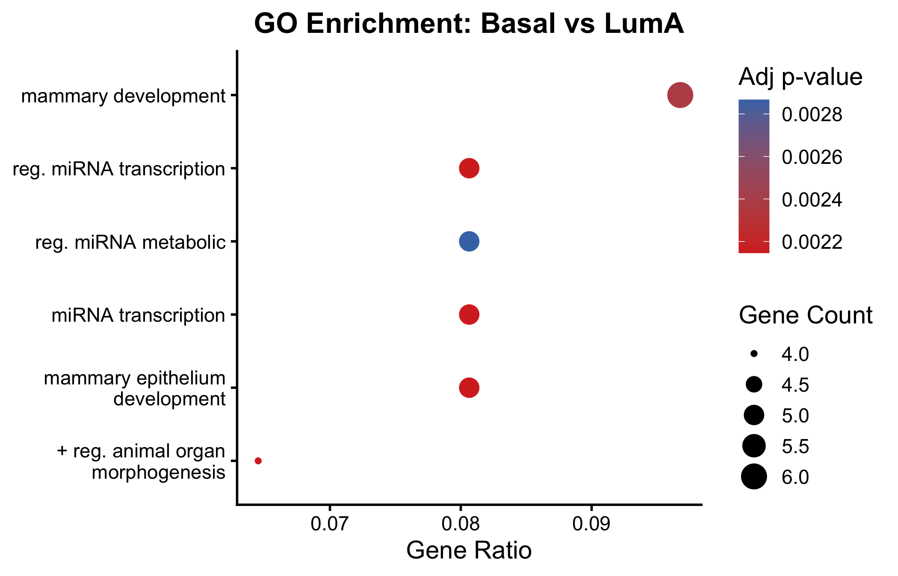

# 🧬 TCGA Breast Cancer RNA-seq Analysis

## Differential Expression, Subtype Characterization, and Biological Interpretation

---

## Overview

This project presents a comprehensive analysis of RNA-seq data from The Cancer Genome Atlas (TCGA) Breast Cancer (BRCA) cohort.

The objective is to identify subtype-specific transcriptional differences and derive biological insights across major breast cancer subtypes using established statistical and bioinformatics methods.

The analysis integrates:
- Differential gene expression  
- Dimensionality reduction  
- Functional enrichment  

---

## Dataset

- **Source:** TCGA BRCA RNA-seq (Illumina HiSeq)  
- **Sample size:** ~1000 tumor samples  

### Subtypes (PAM50 classification):
- Luminal A (reference)
- Luminal B
- HER2-enriched
- Basal-like
- Normal-like

---

## Methods

### Data Preprocessing

- Converted data into sample × gene matrix  
- Removed low-expression genes  
- Selected top ~5000 highly variable genes  

---

### Principal Component Analysis (PCA)

PCA was performed to assess global transcriptional variation and subtype separation.



#### Findings:
- Basal subtype forms a distinct cluster  
- Luminal A and Luminal B partially overlap  
- HER2 and Normal lie in intermediate regions  

---

### Differential Expression Analysis

Differential expression was performed using DESeq2 with Luminal A as the reference.

#### Comparisons:
- Basal vs Luminal A  
- HER2 vs Luminal A  
- Luminal B vs Luminal A  
- Normal vs Luminal A  

#### Thresholds:
- Adjusted p-value (FDR) < 0.05  
- |log2 Fold Change| > 1  

---

### Volcano Plot (Basal vs Luminal A)



#### Key observations:
- Strong differential expression signal  
- Upregulated: FOXC1, SOX8  
- Downregulated: ESR1, PGR, GATA3  

---

### Gene Ontology (GO) Enrichment



#### Enriched processes:
- Mammary gland development  
- miRNA regulation  
- Hormone signaling pathways  

---

## Results Summary

- Basal subtype shows strongest transcriptional divergence  
- Luminal B shows proliferation-related differences  
- HER2 shows signaling-driven changes  
- Normal is closest to Luminal A  

---

## Project Structure

data/  
&nbsp;&nbsp;&nbsp;&nbsp;raw/  
&nbsp;&nbsp;&nbsp;&nbsp;processed/  

figures/  
&nbsp;&nbsp;&nbsp;&nbsp;enrichment/  
&nbsp;&nbsp;&nbsp;&nbsp;final/  

results/  
&nbsp;&nbsp;&nbsp;&nbsp;deseq2/  
&nbsp;&nbsp;&nbsp;&nbsp;biological/  
&nbsp;&nbsp;&nbsp;&nbsp;enrichment/  
&nbsp;&nbsp;&nbsp;&nbsp;qc/  

scripts/  

README.md  
environment.yml  

---

## Reproducibility

```bash
conda env create -f environment.yml
conda activate tcga-rnaseq-deseq2

## Data Access

TCGA data can be downloaded from:
https://xena.ucsc.edu/
```


## Skills Demonstrated

- Bulk RNA-seq analysis  
- Differential gene expression  
- Cancer genomics analysis  
- Functional enrichment analysis  
- Data visualization  
- Bioinformatics pipeline development  

---

## Impact

This project demonstrates transcriptomic analysis of breast cancer data and reflects workflows used in:

- Cancer genomics research  
- Biomarker discovery  
- Precision medicine  

---

## Author

Divya Reddy  
MS Bioinformatics, Georgia Institute of Technology  
